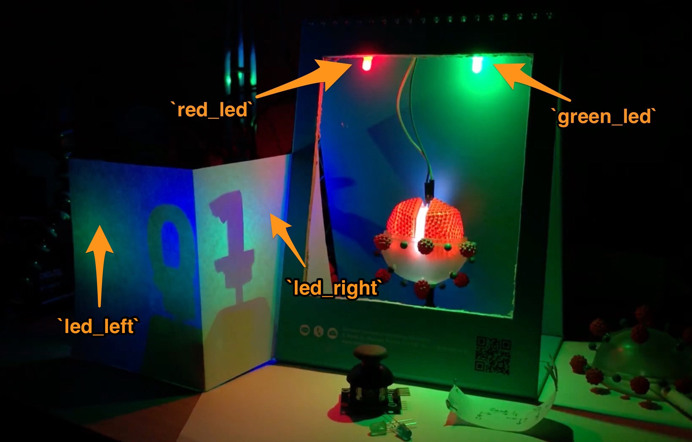
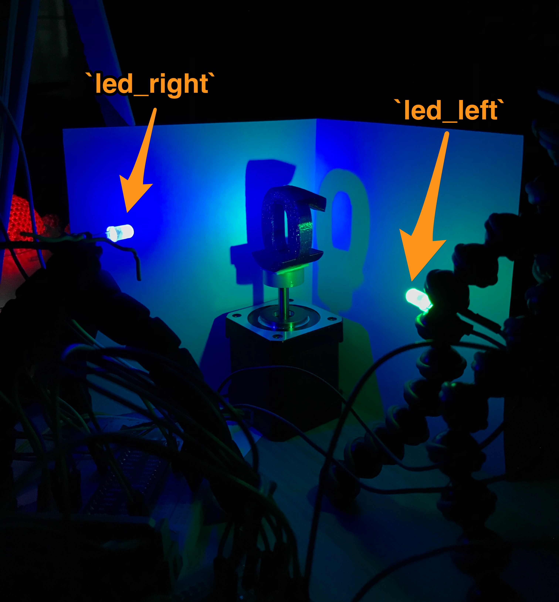
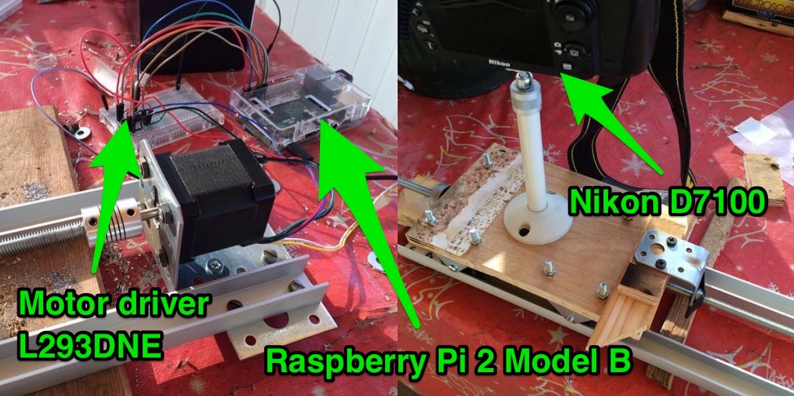
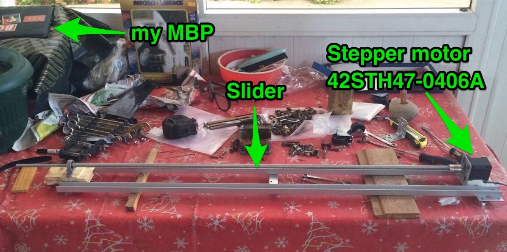

## Demo of Quantum State Tomography

All the code can be found in [qst_demo/](qst_demo) folder.

| Overview    | [[video](https://youtu.be/uJqOmeSxVj4)] |
| :------------- | :---- |
|        |        |

## Camera Slider

All the code can be found in [camera_slider/](camera_slider) folder.

| Overview    | [[video](https://vk.com/video182954756_456239030)] |
| :------------- | :---- |
|        |  |
|        |

## Additional software/urls

| Name | Description     |
| :------------- | :------------- |
| Control an LED   | [[Tutorial](https://thepihut.com/blogs/raspberry-pi-tutorials/27968772-turning-on-an-led-with-your-raspberry-pis-gpio-pins)] on how to turn on and off an LED with Raspberry Pi  |
| Control Stepper Motor   | [[Tutorial by adafruit](https://learn.adafruit.com/adafruits-raspberry-pi-lesson-10-stepper-motors/software)] on how to control Stepper Motor using L293D with Raspberry Pi  |

## Components & parts

| Item | Description     |
| :------------- | :------------- |
|  Motor Driver for Steppers - L293D  |  [[link to adafruit](https://www.adafruit.com/product/807)]  |
| Stepper Motor | For example [[this one on adafruit](https://www.adafruit.com/product/324)] or [[this one on aliexpress](https://ru.aliexpress.com/item/Free-shipping-1PCS-Nema17-Stepper-Motor-42-motor-Nema-17-motor-42BYGH-1-7A-17HS4401-motor/32667831438.html?spm=a2g0v.search0604.3.8.3e8c5c04yllQJ5&ws_ab_test=searchweb0_0,searchweb201602_2_10152_10151_10065_10344_10068_5722815_10342_10343_10340_5722915_10341_10543_5711416_5722615_10696_10084_10083_10618_10307_10301_5722715_10059_100031_10103_5711515_10624_10623_10622_5722515_10621_10620_10125-10620,searchweb201603_19,ppcSwitch_5&algo_expid=a2d6831e-99a7-42c1-b505-666015b13d76-1&algo_pvid=a2d6831e-99a7-42c1-b505-666015b13d76&priceBeautifyAB=0)] |
| LEDs   | [[link to aliexpress](https://ru.aliexpress.com/item/MCIGICM-100pcs-5mm-LED-diode-Light-Assorted-Kit-DIY-LEDs-Set-White-Yellow-Red-Green-Blue/32323764461.html?spm=a2g0s.9042311.0.0.238433ed8bpGs0)]  |
